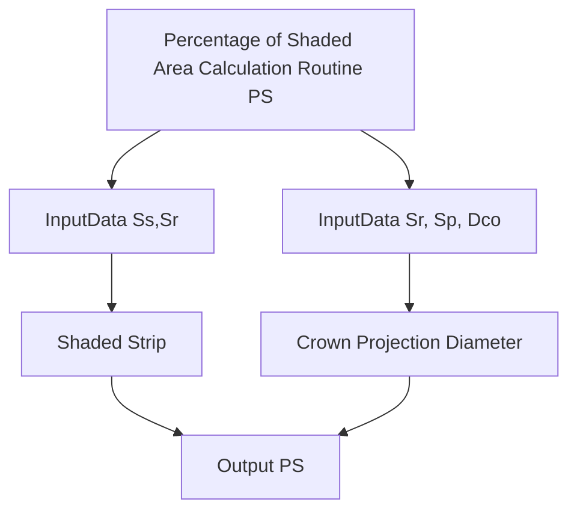

# Percent Shaded Area Service

The **PercentShadedAreaService** module provides functions to calculate the percent shaded area in different scenarios involving plant canopy projection. It includes methods for calculating the shaded area based on plant canopy projection and plant strip projection.

## Introduction

This module offers calculations for determining the percent shaded area under different conditions involving plant canopy projection. The calculations depend on input parameters that describe the characteristics of the canopy projection and plant arrangement. The module handles the mathematical aspects and presents convenient methods for performing these calculations.

## Percentage of Shaded Area Calculation PS



## Methods

### `calculate_by_plant_canopy_projection(input_entity: PlantCanopyProjectionInputEntity) -> Decimal`

Calculates the percent shaded area based on plant canopy projection.

- `input_entity`: An instance of `PlantCanopyProjectionInputEntity` containing projection parameters.
- Returns: Percentage of the shaded area.

### `calculate_by_plant_strip_projection(input_entity: PlantStripProjectionInputEntity) -> Decimal`

Calculates the percent shaded area based on plant strip projection.

- `input_entity`: An instance of `PlantStripProjectionInputEntity` containing projection parameters.
- Returns: Percentage of the shaded area.

---

```

```
