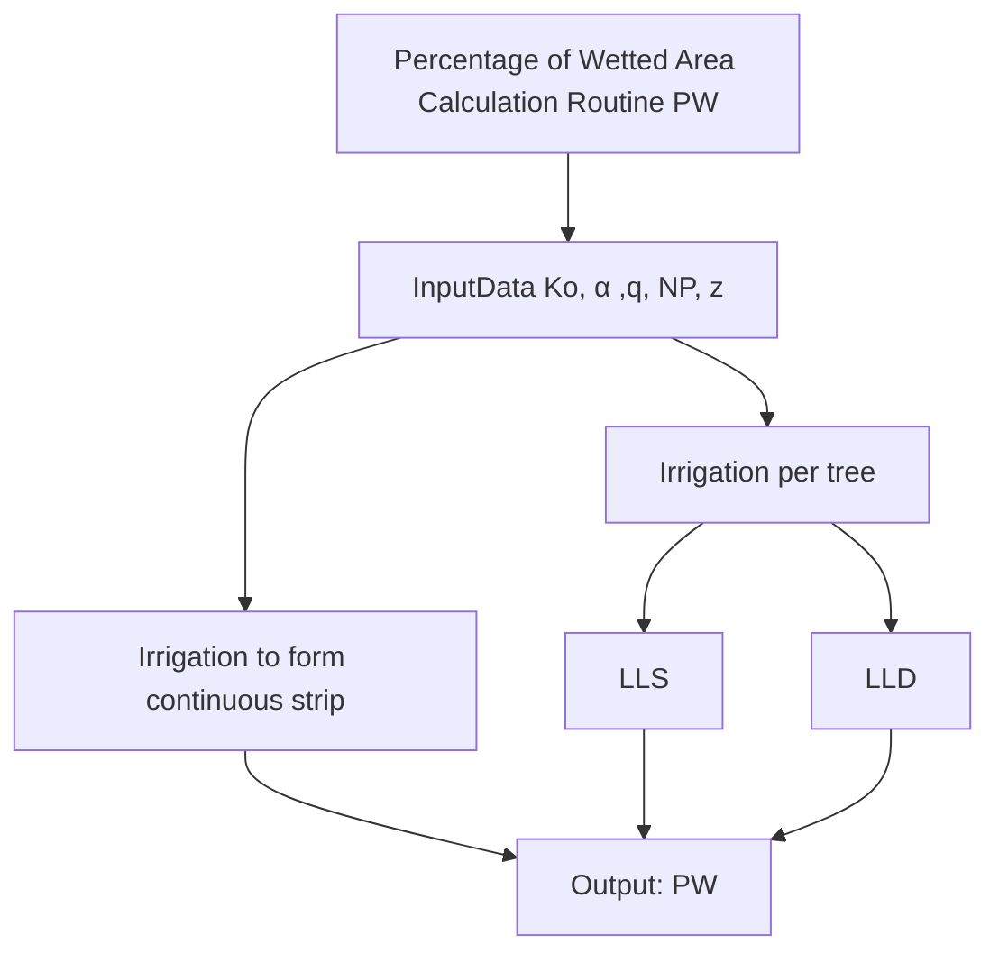

# Percent Wetted Area Service

The **PercentWettedAreaService** module provides functions to calculate the percent wetted area in various irrigation scenarios. It includes methods for calculating wetted areas for different types of irrigation systems, such as irrigation by tree, twice saturated wetted radius, and continuous strip irrigation.

## Introduction

This module offers calculations to determine the percent wetted area for different irrigation scenarios. The calculations depend on input parameters that define the characteristics of the irrigation system. The module handles the underlying mathematics and provides convenient methods for these calculations.

## Percentage of Wetted Area Calculation PW

## Methods

### `calculate_irrigation_by_tree(input_entity: IrrigationTreeEntity) -> Decimal`

Calculates the percent wetted area for an irrigation system by tree.

- `input_entity`: An instance of `IrrigationTreeEntity` containing system parameters.
- Returns: Percentage of the wetted area.

### `calculate_twice_saturated_wetted_radius(input_entity: SaturatedWetRadiusX2Entity) -> Decimal`

Calculates the twice saturated wetted radius for an irrigation system.

- `input_entity`: An instance of `SaturatedWetRadiusX2Entity` containing system parameters.
- Returns: Twice saturated wetted radius.

### `calculate_continuous_strip(input_entity: ContinuousStripEntity) -> Decimal`

Calculates the percent wetted area for a continuous strip irrigation system.

- `input_entity`: An instance of `ContinuousStripEntity` containing system parameters.
- Returns: Percentage of the wetted area.

---
